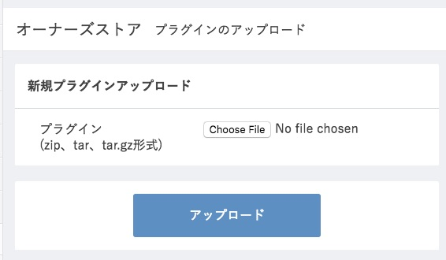
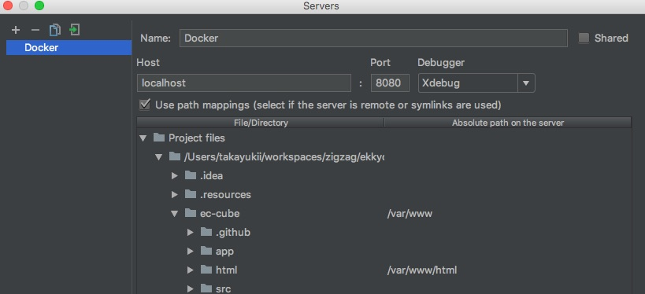

# ekkyo-kun EC-CUBE

「えっきょうくん」のEC-CUBEプラグインです。

## EC-CUBEの起動方法

### ec-cubeのGitリポジトリをクローンする

```
$ pwd
/path/to/ekkyo-kun-eccube
$ git clone https://github.com/EC-CUBE/ec-cube
```

### Dockerを起動する

```
$ docker-compose up
```

[http://localhost:8080](http://localhost:8080) にアクセスします。

### プラグインをアップロードする

[http://localhost:8080/admin](http://localhost:8080/admin) にアクセスしログインします。

ログインは admin:password で行います。次に オーナーズストア > プラグイン > プラグイン一覧 > プラグインのアップロードはこちら をたどります。下記の画面からアップロードしプラグインを有効化するとプラグインが動作するようになります。



### ビルドし直した時/うまく起動しなくなったのでやり直したい時

1. ec-cube/app/Pluginを空にする
2. コンテナを削除する（docker rm -f $(docker ps -qa)）
3. Dockerを起動する（docker-compose up）

## 開発方法

### IDEAのRemote Debugを設定する


